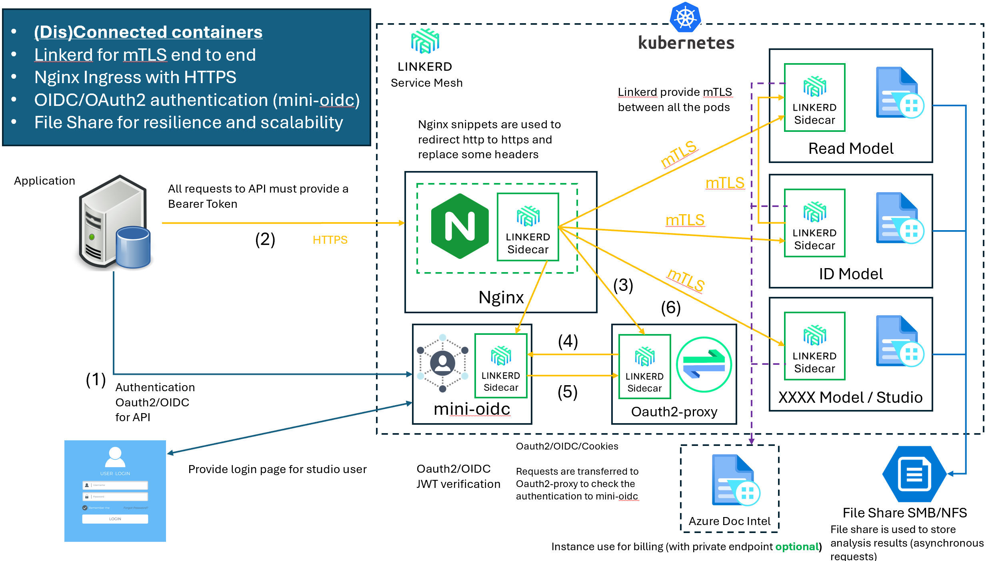

# AI Services containers on-premise

## Why ?

Ai Services on containers from Azure are a way to use prebuilt models on premise without sending datas to Azure.

## How it works ?

### Components

Containers are deployed in a Kubernetes cluster and this repo will help you to deploy them in a secure way.  
By default you can not use HTTPS with certificates and no authentication is provided with the containers.  
The user need to handle both of those security aspects.

### Architecture and related security

This is an example with Document Intelligence Containers.

**Nginx** ingress controller will route the requests to the different backends [Nginx documentation](https://github.com/kubernetes/ingress-nginx)

**Linkerd** provide transport security with mTLS between components. [Linkerd documentation](https://linkerd.io/)

**Mini-oidc** provide authentication (OIDC/Oauth2) [minioidc documentation](https://github.com/fernandoescolar/minioidc)
  - 2 users are created with generated passwords, one for API consumption and one for human user
  - Provide a lgin page for the UI

**Oauth2-proxy** act as a proxy to forward authentication requests to mini-oidc [OAuth2 Proxy documentation](https://oauth2-proxy.github.io/oauth2-proxy/)

File share is used to share datas for asynchronous calls, logging or License consumption.

## Available charts

You can find the available charts in the [Charts](./charts) directory

The available charts are :

**Document Intelligence with prebuilt model and studio :**

  - Layout
  - Read
  - ID Document
  - Receipt
  - Invoice
  - Custom Template

[Install](#tools) all the tools before and go to [Document Intelligence : Installation guide](./docs/INSTALL_DOCINTEL.md)

**Stay Tuned** 

Speech To Text : **WIP**  
Text to Speech : **WIP**  
Languages :
  - PII : **WIP**

## Pre-requisites

  - An Azure AI Resources with Private Endpoint
  - VNet with 3 subnets
    - One for AKS
    - A Second one for the VM
    - A Third one for the private endpoints
  - Private DNS Zone
  - AKS Cluster

### Tools

To install all of the components, you need to download some tools :

[KUBECTL](https://kubernetes.io/releases/download/#binaries)  
[HELM](https://github.com/helm/helm/releases)  
[LINKERD](https://github.com/linkerd/linkerd2/releases)  

Those tools do not need installation, you can use them directly on the path, or add them to a standard path in your OS. **Choose the right binary depending of your desktop or use Azure Cloud Shell**

With Cloud Shell, **kubectl** and **helm** are already installed. You need **linkerd** at least

You will need to rename the tools as kubectl(.exe), helm(.exe) and linkerd(.exe). If you are using cloudshell, kubectl and helm are already installed.  

### Azure resources

For simplification, you can use a region where [Bastion with developper SKU is available](https://learn.microsoft.com/en-us/azure/bastion/quickstart-developer) to install your azure resources (Free Bastion )

You can deploy everything directly with the ARM template or follow the manual instructions in each [specific containers documentation](./docs/)
