# Document Intelligence containers

## Deploying the resources

To deploy the required resources to Azure, it is just a one-click deployment.

[](https://portal.azure.com/#create/Microsoft.Template/uri/https%3A%2F%2Fraw.githubusercontent.com%2Fdeuch%2Fai-services-with-containers%2Fmain%2Finfra%2Fdeployment.json)

This will deploy the following resources:

- Virtual network with 3 subnets
- AKS cluster
- 2 Private DNS Zones
- Document Intelligence instance with a Private Endpoint
- Windows 11 VM and Bastion host using Developer SKU

After deployment, go to [Software installation](#software-installation) section. 

### Manual Infrastructure installation

You can use Cloud Shell for manual installation. The command are linux oriented. [Follow the instructions here](./INSTALL_DOCINTEL_ADVANCED.md) to have more advanced options. 

After deployment, continue with the software installation below.

## Software install

**MANDATORY** : To retrieve credentials of your cluster use the az command. Those credentials are used for each tools (kubectl, helm, linkerd)

```sh
az aks get-credentials --name $cluster_name -g $rg_name --admin --overwrite-existing
```

### Installing Linkerd

To install `linkerd`, just use those 2 commands :

```sh
linkerd install --crds --set installGatewayAPI=true| kubectl apply -f -
linkerd install | kubectl apply -f -
```

Check that the installation is finished with kubectl command :

```sh
kubectl get pods -n linkerd
```

It must look like :

```sh
NAME                                     READY   STATUS    RESTARTS   AGE
linkerd-destination-8fcc4d755-rw7dw      4/4     Running   0          75s
linkerd-identity-5bf6f985f8-ntnvx        2/2     Running   0          75s
linkerd-proxy-injector-f9cf67fc4-4bdt6   2/2     Running   0          74s
```

### Helm template configuration

The helm template provide a lot of options in the `values.yaml` file.  
A simple one, named `custom-docintel-values.yaml` will help you the setup everything.
The custom values files are located in [Custom values directory](../charts/custom-values)

Basically you need to set those variables for the first installation of Document Intelligence : 

```yaml
ingress:
  tlsDomain: "aiservices.intra" #Domain of the Private DNS Zone
  autoGenerate: true

#For each model, set enable to True or False 
customTemplate:
  enable: true

layout:
  enable: true

read:
  enable: true

invoice:
  enable: false

receipt:
  enable: true

idDocument:
  enable: true

studio:
  enable: true
```

With Default values, this is what it will be installed/created :

- Ingress NGINX Controller is installed
  - TLS certificates are automatically generated and set for NGINX (full HTTPS)
- mini-oidc
  - Oauth2/OIDC IDP is installed and 2 users and password are generated
    - One user for API (machine to machine)
    - One user (human) for studio
  - Configmap is created for configuration
  - Secret is created with all the logins/passwords for reference
- ouath2Proxy is installed
  - Auto configured for each ingress and to use mini-oidc as IDP and login page
- Full mTLS within the Linkerd service mesh out of the box

More complex configuration can be done if you decide to use the same cluster with mutiples chart. **More on that in the future**

### Helm installation

You need to have the endpoint and the apiKey of your AI Resources.

<details>
<summary>How to get the Key and Endpoint ?</summary>
You can get the API Key and Endpoint for Doc Intelligence from the Azure Portal. Go to your Document Intelligence resource and click on **Keys and Endpoint**. You will find the API Key and the endpoint URL.

<image src="../img/doc-intell-key-endpoint.png" alt="Document Intelligence Key and Endpoint" width="600px" />
</details>

Let's now install the Document Intelligence Helm chart :

1) **Go to the charts directory**

2) In the below command, set :

  - *documentIntelligence.secret.apiKeyValue* with your apiKey

  - *documentIntelligence.secret.endpointValue* with your Document Intelligence endpoint

3) Everything will be installed in the **di** namespace

```bash
helm install di .\ai-document-intelligence -f .\custom-values\custom-docintel-values.yaml -n di --create-namespace --set documentIntelligence.secret.apiKeyValue="XXXXXXXXXXXXXXXX",documentIntelligence.secret.endpointValue="https://mydocintelinstance.cognitiveservices.azure.com/"
```

### Creating Private DNS Zone A Record

**You need to add a record in your Private DNS Zone. Unless, you will not be able to use your VM and reach the studio.**  

Retrieve the private IP of the `Load Balancer` created by the ingress NGINX controller.

```sh
kubectl get svc -n di
# NAME                                          TYPE           CLUSTER-IP   EXTERNAL-IP   PORT(S)                      AGE
# di-ai-document-intelligence-custom-template   ClusterIP      10.4.0.124   <none>        5000/TCP                     7m12s
# di-ai-document-intelligence-id-document       ClusterIP      10.4.0.21    <none>        5050/TCP                     7m12s
# di-ai-document-intelligence-layout            ClusterIP      10.4.0.233   <none>        5000/TCP                     7m12s
# di-ai-document-intelligence-read              ClusterIP      10.4.0.253   <none>        5000/TCP                     7m12s
# di-ai-document-intelligence-receipt           ClusterIP      10.4.0.159   <none>        5050/TCP                     7m12s
# di-ai-document-intelligence-studio            ClusterIP      10.4.0.67    <none>        5001/TCP                     7m12s
# di-ingress-nginx-controller                   LoadBalancer   10.4.0.82    10.0.0.12     80:31590/TCP,443:30690/TCP   7m12s
# di-ingress-nginx-controller-admission         ClusterIP      10.4.0.134   <none>        443/TCP                      7m12s
# mini-oidc                                     ClusterIP      10.4.0.86    <none>        8000/TCP                     7m12s
# oauth2-proxy                                  ClusterIP      10.4.0.18    <none>        4180/TCP                     7m12s
```

In this example, you need to use the `external-ip` of the `Loadbalancer` which is `10.0.0.12`.

```sh
private_ip="10.0.0.12"
# $private_ip="10.0.0.12" # if using windows
az network private-dns record-set a add-record -g $rg_name -z $domain -n "*" -a $private_ip
```

You can add the record directly in the portal too. Use "*" as name and the IP of the load balancer.


## Connecting to the doc intelligence studio

To connect to the Document Intelligence Studio, you need to reach the virtual network of the service.
For that, you will use the Azure VM as a Jumpbox machine accessed by `Bastion`.
From your VM, select `Connect via Bastion` in the portal. This will open a browser session to your VM. Use your VM user name and password to connect.

In your VM, use a browser and reach the FQDN of your studio deployment.
The FQDN is returned after the helm installation.  

To retrieve it, check the services and the HOSTS associated to the studio ingress. 

```sh
kubectl get ingress -n di
# NAME                                      CLASS   HOSTS                                                    ADDRESS     PORTS     AGE
# di-ai-document-intelligence-studio        nginx   docintel.aiservices.intra                                10.0.0.12   80, 443   6m26s
```

In this case it is `docintel.aiservices.intra`.

To login to the studio, use :
  - Username : user
  - Password : the OIDC_USER_SECRET

To retrieve the password with Windows :

```powershell
kubectl get secrets -n di -o jsonpath="{.data.OIDC_USER_SECRET}" oidc-secrets | %{[Text.Encoding]::UTF8.GetString([Convert]::FromBase64String($_))}
```

With Linux : 

```console
kubectl get secrets -n di -o jsonpath="{.data.OIDC_USER_SECRET}" oidc-secrets | base64 -d
```

When prompted in the UI to set your Document Intelligence resource, use the URL found above (in our case it is `docintel.aiservices.intra`), the same your are using to connect to the studio.

You can try to scan a sample document or upload your own document.

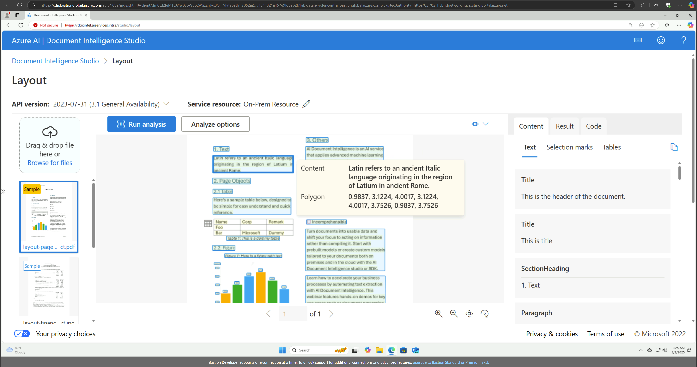

## Running the Document Intelligence API using Python application

### Generate config for your python code

In the [Tools](../tools) directory, you will find some scripts to help you to generate and retrieve all the informations of your deployment (assume **di** is your namespace as set by default): 

**You need to have kubectl installed as the script will use it to retrieve all the informations**  

**Only available for Windows for now**

```shell
.\getconfig.ps1 di
```

It will generate an *.env* file with all the informations you need to use with python for example.  

#### Test python example script

In the [sample directory](../python/docintel/) you can find a python sample code to run a layout extraction.

You need to retrieve the *.env* file from the previous command and copy it in the same directory as the **layout.py* script.

You need to install some python dependencies first :

```powershell
pip install -r requirements
```

And run the code :

```powershell
python3 layout.py 
```

You can change the document URL in the code : 

```python
# sample document
formUrl = "https://raw.githubusercontent.com/Azure-Samples/cognitive-services-REST-api-samples/master/curl/form-recognizer/sample-layout.pdf"
```

## Install certificates in the VM

<details>  
  
<summary> Click for details </summary>  

With auto generated certificates, your browser will show you some warnings about non trusted certificates. Follow this guide to install the certificates in your windows desktop :  

Certificates are not Trusted :  

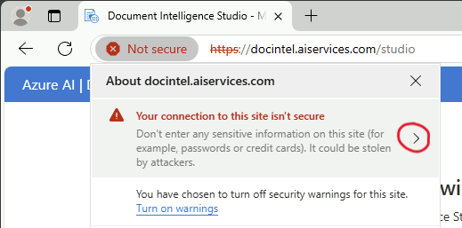

Check informations about the certificate :  


Export the certificate :  

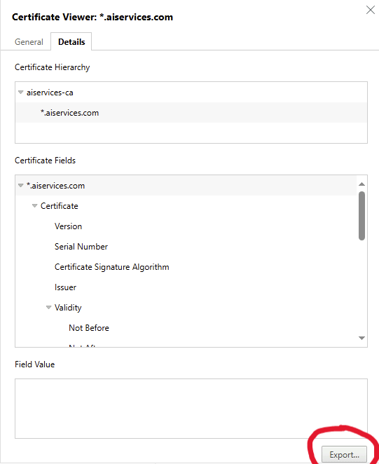

Choose PKCS 7 as format with **Certificate chain**  

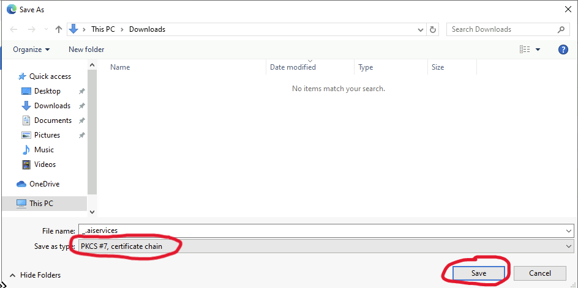

Launch mmc  

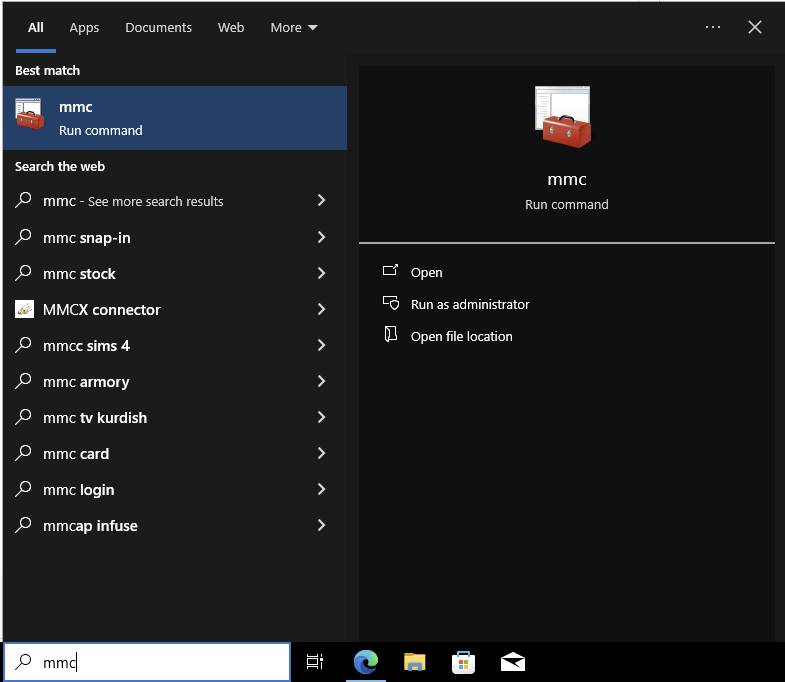

Add a snap-in  

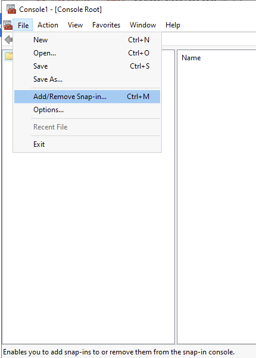

Choose Certificates and click "Add"  


Choose Computer Account  

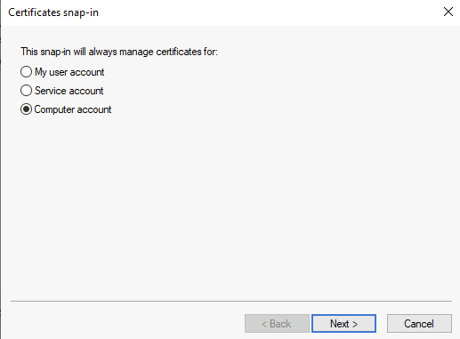

Choose the **Trusted Root Certificate Authorities** section to import  the certificate  

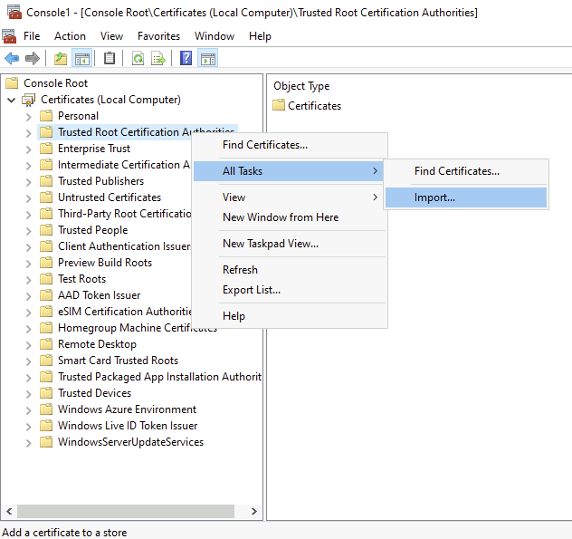

Choose the previously exported certificate  

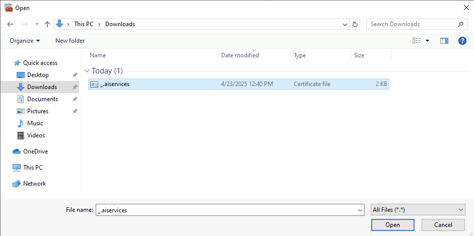

Verify the certificate file  

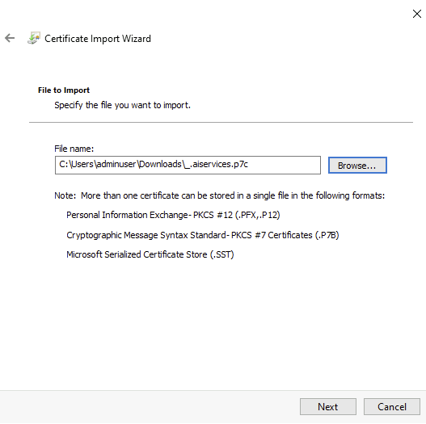

Select Next to finalize import :  

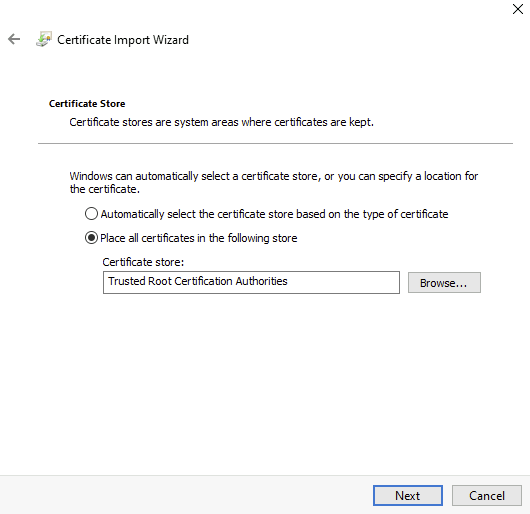

And voilà ! No more error  

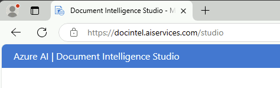

</details>

## Troubleshooting

### Pods

Assume that the namespace is **di** :

Verify that pods are deployed :

```console
kubectl get pods -n di
```

```console
di-ai-document-intelligence-id-document-54799c5866-x5w2k   2/2     Running   0          112m
di-ai-document-intelligence-invoice-85df9bf5f6-2g2sh       2/2     Running   0          112m
di-ai-document-intelligence-layout-65dbc6d467-dppq2        2/2     Running   0          112m
di-ai-document-intelligence-read-5f87d54f7c-vw782          2/2     Running   0          112m
di-ai-document-intelligence-receipt-9499c67c9-k4jxp        2/2     Running   0          112m
di-ai-document-intelligence-studio-5f45fbb674-fgnfd        2/2     Running   0          112m
di-ingress-nginx-controller-75ccd67b94-w5445               2/2     Running   0          112m
mini-oidc-568b975d44-tgj7l                                 2/2     Running   0          112m
oauth2-proxy-7cfb559cd8-hb5f4                              2/2     Running   0          112m
```

Check that every pods are started correctly

### Volumes

Check that the volumes are created and mount :

```console
kubectl get pv
kubectl get pvc -n di
```

```console
NAME                                       CAPACITY   ACCESS MODES   RECLAIM POLICY   STATUS   CLAIM                                            STORAGECLASS   VOLUMEATTRIBUTESCLASS   REASON   AGE
pvc-2bf79f0a-e887-41fe-a2d5-8d59413737c3   1Gi        RWX            Delete           Bound    di/di-ai-document-intelligence-studio-file       di-azurefile   <unset>                          112m
pvc-69c77187-0b9d-4c41-b141-7c98c63dce08   1Gi        RWX            Delete           Bound    di/di-ai-document-intelligence-output            di-azurefile   <unset>                          112m
pvc-c2a1dbaa-5dd4-4fca-8664-6d1870384c5d   1Gi        RWX            Delete           Bound    di/di-ai-document-intelligence-shared            di-azurefile   <unset>                          112m
pvc-df5b9196-2504-40a0-998a-e28166863fa3   1Gi        RWX            Delete           Bound    di/di-ai-document-intelligence-studio-database   di-azurefile   <unset>                          112m
```

```console
NAME                                          STATUS   VOLUME                                     CAPACITY   ACCESS MODES   STORAGECLASS   VOLUMEATTRIBUTESCLASS   AGE
di-ai-document-intelligence-output            Bound    pvc-69c77187-0b9d-4c41-b141-7c98c63dce08   1Gi        RWX            di-azurefile   <unset>                 113m
di-ai-document-intelligence-shared            Bound    pvc-c2a1dbaa-5dd4-4fca-8664-6d1870384c5d   1Gi        RWX            di-azurefile   <unset>                 113m
di-ai-document-intelligence-studio-database   Bound    pvc-df5b9196-2504-40a0-998a-e28166863fa3   1Gi        RWX            di-azurefile   <unset>                 113m
di-ai-document-intelligence-studio-file       Bound    pvc-2bf79f0a-e887-41fe-a2d5-8d59413737c3   1Gi        RWX            di-azurefile   <unset>                 113m
```

Check that the volumes are bound and healthy.