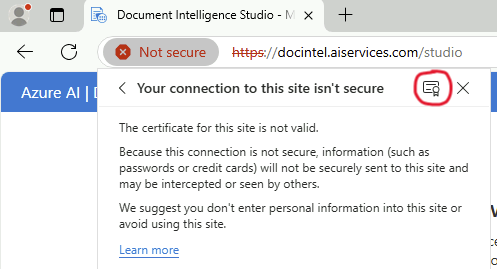
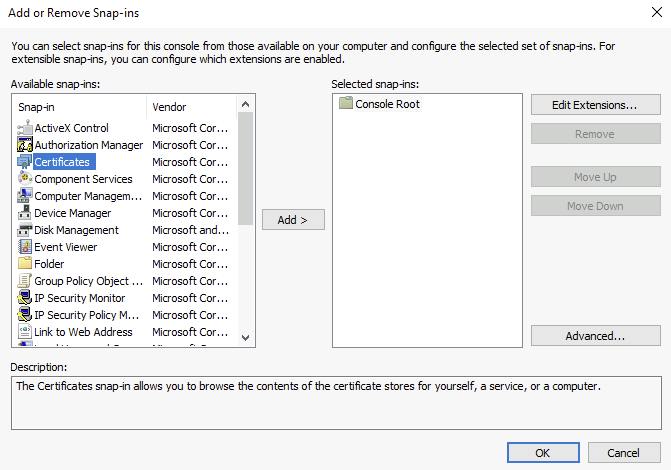

# AI Services containers on premise

### Automatic installation

The magic button : 

[](https://portal.azure.com/#create/Microsoft.Template/uri/https%3A%2F%2Fraw.githubusercontent.com%2Fdeuch%2Fai-services-with-containers%2Fmain%2Finfra%2Fdeployment.json)

After deployment, go to  [Software installation](#software-installation) : 

### Manual installation

#### Resource group

Create a resource group for all the resources : 

```bash
rg_name=docintel-local
location=northeurope

az group create --name $rg_name --location $location
```

#### VNet

Create a VNet in your resource group :

1) Use 10.0.0.0/16 as address space
2) Create a subnet for AKS
    - Name : aks
    - CIDR : 10.0.0.0/24
3) Create a subnet for the VM
    - Name : vms
    - CIDR : 10.0.1.0/27
3) Create a subnet for the private endpoit
    - Name : vms
    - CIDR : 10.0.1.32/27


```bash
vnet_name=vnet-local
subnet_aks=aks
subnet_vm=vm
subnet_pe=pe

az network vnet create --name $vnet_name --resource-group $rg_name --location $location --address-prefix 10.0.0.0/16 --subnet-name $subnet_aks --subnet-prefixes 10.0.0.0/24
az network vnet subnet create --name $subnet_vm --resource-group $rg_name --vnet-name $vnet_name --address-prefixes 10.0.1.0/27
az network vnet subnet create --name $subnet_pe --resource-group $rg_name --vnet-name $vnet_name --address-prefixes 10.0.1.32/27
```

#### VM

Create a **Windows** VM, with B4ms SKU in the **vms** subnet.  
Use a login/password to authenticate.
Please set the according values for *--admin-username* and *--admin-password*

```bash
vm_name=vm-ai

az vm create --name $vm_name --resource-group $rg_name --location $location --admin-username "XXXXXXXXX" --admin-password "XXXXXXXXXX" --vnet-name $vnet_name --subnet $subnet_vm --public-ip-address "" --accept-term --license-type Windows_Client --size Standard_B4ms --image MicrosoftWindowsDesktop:Windows-10:win10-22h2-pro:19045.5737.250407
```

#### Bastion

When connecting to the VM through the portal, and Bastion with Developper SKU is automatically created.

#### Private DNS Zone

You need to create a Private DNS Zone :

1) Choose a domain name, for eg *aiservices.com*
2) Create a VNet Link between the Private DNS Zone and the VNet

As an example, we use **aiservices.com**.

```bash
domain="aiservices.intra"

az network private-dns zone create -g $rg_name -n $domain
az network private-dns link vnet create -g $rg_name -n aidnslink -z $domain -v $vnet_name -e true
```

#### Private Endpoint for the AI Resources

1) Create your AI Resource with a custom domain name and public access disabled
2) Create a private endpoint from the AI Resources
3) Integrate with Private DNS Zone (it will create a new one)
4) Ensure that the Private DNS Zone is VNet Linked to your VNet

```bash
aiaccount_name=docintelprivate
pe_ai=pe-docintel
az cognitiveservices account create -n $aiaccount_name -g $rg_name --kind FormRecognizer --sku S0 -l $location --yes --custom-domain $aiaccount_name
resourceId=$(az cognitiveservices account show --resource-group $rg_name --name $aiaccount_name --query id --output tsv)
az resource update --ids $resourceId  --set properties.networkAcls="{'defaultAction':'Deny'}"
az resource update --ids $resourceId  --set properties.publicNetworkAccess="Disabled"

az network private-endpoint create --connection-name pe-aiservices --name $pe_ai   --private-connection-resource-id $resourceId  --resource-group $rg_name --subnet $subnet_pe --group-id account --vnet-name $vnet_name

az network private-dns zone create --resource-group $rg_name --name "privatelink.cognitiveservices.azure.com"

az network private-dns link vnet create --resource-group $rg_name --zone-name "privatelink.cognitiveservices.azure.com" --name peaidnslink --virtual-network $vnet_name --registration-enabled false

az network private-endpoint dns-zone-group create --resource-group $rg_name --endpoint-name $pe_ai --name dns-zone-group --private-dns-zone "privatelink.cognitiveservices.azure.com" --zone-name aiservices
```

### AKS Cluster

Create a cluster with 2 nodepools : One for the system and one for your applicatives pods.

```bash
cluster_name="aiservices"
subnetResourceId=$(az network vnet subnet show --resource-group $rg_name --vnet-name $vnet_name --name $subnet_aks --query id --output tsv)
 
az aks create --name $cluster_name --resource-group $rg_name --location $location --network-plugin azure --network-plugin-mode overlay --pod-cidr 10.244.0.0/16 --generate-ssh-keys --vnet-subnet-id $subnetResourceId --dns-service-ip 10.4.0.10 --service-cidr 10.4.0.0/24 --node-vm-size Standard_D2s_v3 --node-count 3

az aks nodepool add -g $rg_name -n userai --cluster-name $cluster_name --enable-cluster-autoscaler --min-count 5 --max-count 8 --node-count 5 --node-vm-size Standard_D8s_v5 --vnet-subnet-id $subnetResourceId
```

To retrieve credentials of your cluster use the az command. Those credentials are used for each tools (kubectl, helm, linkerd)

```bash
az aks get-credentials --name $cluster_name -g $rg_name --admin --overwrite-existing
```

## Software Installation

### Linkerd

To install linkerd, just use those 2 commands :

```bash
linkerd install --crds --set installGatewayAPI=true| kubectl apply -f -
linkerd install | kubectl apply -f -
```
Check that the installation is finished with kubectl command :
```bash
kubectl get pods -n linkerd
```
It must look like :

```console
NAME                                     READY   STATUS    RESTARTS   AGE
linkerd-destination-8fcc4d755-rw7dw      4/4     Running   0          75s
linkerd-identity-5bf6f985f8-ntnvx        2/2     Running   0          75s
linkerd-proxy-injector-f9cf67fc4-4bdt6   2/2     Running   0          74s
```

### Helm template configuration

The helm template provide a lot of options in the values.yaml file.  
A simple one, named custom-docintel-values.yaml will help you the setup everything.
The custom values files are located in [Custom values directory](../charts/custom-values)

Basically you need to set those variables for the first installation of Document Intelligence : 

```yaml
ingress:
  tlsDomain: "aiservices.intra" #Domain of the Private DNS Zone
  autoGenerate: true

#For each model, set enable to True or False 
customTemplate:
  enable: true

layout:
  enable: true

read:
  enable: true

invoice:
  enable: false

receipt:
  enable: true

idDocument:
  enable: true

studio:
  enable: true
```

With Default values, this is what it will be installed/created : 
- Ingress NGINX Controller is installed
  - TLS certificates are automatically generated and set for NGINX (full HTTPS)
- mini-oidc
  - Oauth2/OIDC IDP is installed and 2 users and password are generated
    - One user for API (machine to machine)
    - One user (human) for studio
  - Configmap is created for configuration
  - Secret is created with all the logins/passwords for reference
- ouath2Proxy is installed
  - Auto configured for each ingress and to use mini-oidc as IDP and login page
- Full mTLS within the Linkerd service mesh out of the box

More complex configuration can be done if you decide to use the same cluster with mutiples chart. **More on that in the future**

### Helm installation

**You need to have the endpoint and the apiKey of your AI Resources.**

Let now install the Document Intelligence Helm chart :

1) **Go to the charts directory**
2) In the below command, set :
  - *documentIntelligence.secret.apiKeyValue* with your apiKey
  - *documentIntelligence.secret.endpointValue* with your Document Intelligence endpoint

```bash
helm install di .\ai-document-intelligence -f .\custom-values\custom-docintel-values.yaml -n di --create-namespace --set documentIntelligence.secret.apiKeyValue="XXXXXXXXXXXXXXXX",documentIntelligence.secret.endpointValue="https://mydocintelinstance.cognitiveservices.azure.com/"
```

### Private DNS Zone A Record

Retrieve the private IP of the Load Balancer :

```console
NAME                                          TYPE           CLUSTER-IP   EXTERNAL-IP   PORT(S)                      AGE
di-ai-document-intelligence-custom-template   ClusterIP      10.4.0.124   <none>        5000/TCP                     7m12s
di-ai-document-intelligence-id-document       ClusterIP      10.4.0.21    <none>        5050/TCP                     7m12s
di-ai-document-intelligence-layout            ClusterIP      10.4.0.233   <none>        5000/TCP                     7m12s
di-ai-document-intelligence-read              ClusterIP      10.4.0.253   <none>        5000/TCP                     7m12s
di-ai-document-intelligence-receipt           ClusterIP      10.4.0.159   <none>        5050/TCP                     7m12s
di-ai-document-intelligence-studio            ClusterIP      10.4.0.67    <none>        5001/TCP                     7m12s
di-ingress-nginx-controller                   LoadBalancer   10.4.0.82    10.0.0.12     80:31590/TCP,443:30690/TCP   7m12s
di-ingress-nginx-controller-admission         ClusterIP      10.4.0.134   <none>        443/TCP                      7m12s
mini-oidc                                     ClusterIP      10.4.0.86    <none>        8000/TCP                     7m12s
oauth2-proxy                                  ClusterIP      10.4.0.18    <none>        4180/TCP                     7m12s
```

In this example, you need to use the external-ip of the Loadbalancer -> 10.0.0.12

```bash
private_ip="10.0.0.12"
az network private-dns record-set a add-record -g $rg_name -z $domain -n "*" -a $private_ip
```

### Install certificates in the VM

Certificates are not Trusted :  


Check information about the certificate :  



Export the certificate :  


Choose PKCS 7 as format with **Certificate chain**  


Launch mmc  


Add a snap-in  


Choose Certificates and click "Add"  



Choose Computer Account  


Choose the **Trusted Root Certificate Authorities** section to import  the certificate  


Choose the previously exported certificate  


Verify the certificate file  


Select Next to finalize import :  


And voilà ! No more error  


## Troubleshooting

